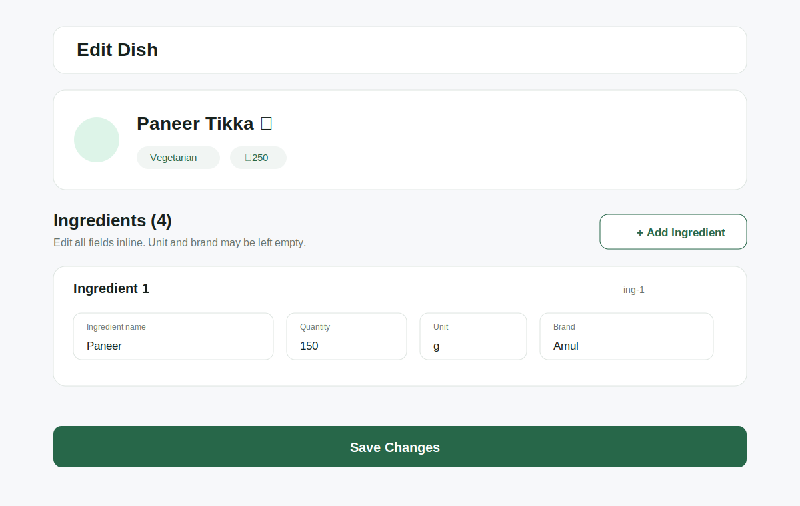

# Fitshield Edit Dish Assessment

This Flutter project implements the **Edit Dish** screen for the Fitshield Partner App assessment.

The screen uses the provided mock dish data and allows users to edit, add, remove, reset, and save ingredient changes locally. No API, authentication, database, or Firebase integration is used.

## Project Overview

The application loads the supplied dish data from a local mock object and initializes the editable ingredient list from it.

Users can:

- Edit ingredient name, quantity, unit, and brand
- Add a new empty ingredient
- Remove an ingredient immediately
- Reset local changes back to the original mock data
- Validate ingredient values inline
- Confirm the save action
- Generate and print the required payload
- View success feedback after saving

## Features

- Inline editing for ingredient name, quantity, unit, and brand
- Frontend-generated ingredient IDs in `ing-N` format
- Immediate add and remove behavior
- Reset button to restore the original mock dish ingredients
- Inline validation for ingredient name and quantity
- Numeric quantity input support
- Confirmation dialog before saving
- Exact required payload generation and console logging
- Success snackbar after the simulated save
- Loading state during save
- Disabled Save button while saving
- Auto-focus and auto-scroll for newly added ingredients
- Keyboard Next/Done navigation
- Empty ingredient state
- Responsive Material 3 layout
- GetX state management and dependency injection
- MVC-style project structure
- Centralized colors, dimensions, strings, and typography
- Reusable fields, buttons, cards, headers, dialogs, and helpers
- Proper disposal of text, focus, and scroll controllers

## Screenshot



> Run the project on a device or emulator to capture a platform-specific screenshot.

## Architecture

The project follows a lightweight **MVC-style architecture with GetX**.

- **Models** represent dish, ingredient, and editable ingredient data.
- **View** renders the Edit Dish screen and delegates actions to the controller.
- **Controller** owns observable state, validation, add/remove/reset actions, ID generation, payload construction, save coordination, scrolling, and lifecycle disposal.
- **Binding** registers the feature controller using GetX dependency injection.
- **Core** contains shared theme, constants, helpers, extensions, validators, and reusable widgets.
- **Data** contains the mock dish response provided in the assessment.

## Folder Structure

```text
lib/
├── core/
│   ├── constants/
│   ├── extensions/
│   ├── helpers/
│   ├── theme/
│   ├── utils/
│   └── widgets/
├── data/
│   └── mock_dish_data.dart
├── features/
│   └── edit_dish/
│       ├── bindings/
│       ├── controllers/
│       ├── models/
│       ├── views/
│       └── widgets/
└── main.dart
```

## File Responsibilities

### `lib/main.dart`

Application entry point. It starts the app, configures `GetMaterialApp`, applies the theme, opens the Edit Dish screen, and registers the initial GetX binding.

### `lib/data/mock_dish_data.dart`

Contains the hardcoded dish object provided in the assessment. It acts as the local data source, so no API call is required.

### `lib/features/edit_dish/models/dish.dart`

Represents the dish data and converts the supplied mock JSON into structured Dart objects.

### `lib/features/edit_dish/models/ingredient.dart`

Represents a single ingredient with ID, name, quantity, unit, and brand.

### `lib/features/edit_dish/models/ingredient_form_item.dart`

Stores the editable state of one ingredient row, including text controllers, focus nodes, current values, and conversion back to payload data.

### `lib/features/edit_dish/controllers/edit_dish_controller.dart`

Contains the main state and business logic. It handles loading data, editing values, add/remove/reset actions, ID generation, validation, payload construction, confirmation, save feedback, scrolling, and controller disposal.

### `lib/features/edit_dish/bindings/edit_dish_binding.dart`

Registers `EditDishController` through GetX dependency injection.

### `lib/features/edit_dish/views/edit_dish_view.dart`

Displays the dish summary, ingredient section, Add Ingredient action, Reset action, editable rows, empty state, and Save Changes button.

### `lib/features/edit_dish/widgets/dish_summary_card.dart`

Displays the dish name, category, price, and verification status.

### `lib/features/edit_dish/widgets/ingredient_row.dart`

Displays one editable ingredient row with name, quantity, unit, brand, validation, responsive layout, and remove action.

### `lib/features/edit_dish/widgets/empty_ingredients_view.dart`

Displays guidance when the local ingredient list is empty.

### `lib/core/utils/validators.dart`

Contains reusable ingredient-name and quantity validation methods.

### `lib/core/utils/id_generator.dart`

Generates new ingredient IDs in the same `ing-N` format as the supplied data.

### `lib/core/constants/`

Contains centralized colors, dimensions, and strings used throughout the app.

### `lib/core/theme/`

Contains Material 3 theme configuration and reusable text styles.

### `lib/core/helpers/`

Contains reusable input formatter, dialog, and snackbar helpers.

### `lib/core/widgets/`

Contains reusable UI primitives such as text fields, cards, buttons, dialogs, and section headers.

### `test/widget_test.dart`

Contains widget tests for important Edit Dish screen content and behavior.

## Ingredient ID Generation

The existing ingredient IDs follow this format:

```text
ing-1
ing-2
ing-3
ing-4
```

During initialization, the controller reads the numeric portion of each existing ID and finds the highest value. The next ingredient receives the next available ID.

```text
Highest existing ID: ing-4
New ingredient ID:   ing-5
Next ingredient ID:  ing-6
```

## Validation Behavior

### Ingredient Name

- Must not be empty
- Must start with a letter or digit

### Quantity

- Must be a valid number
- Must be greater than zero

Unit and brand are optional. Validation errors are shown below the related field.

## Save Flow

1. The user presses **Save Changes**
2. The form is validated
3. Invalid fields show inline errors
4. A confirmation dialog appears when the form is valid
5. The payload is created after confirmation
6. The payload is printed in the console
7. A success snackbar is displayed

Confirmation text:

```text
Are you sure you want to save changes?
```

## Reset Flow

The Reset button restores the form to the original mock dish state.

When Reset is pressed:

1. Locally added ingredients are removed
2. Removed original ingredients are restored
3. Edited values are replaced with their original values
4. The frontend ingredient ID counter is recalculated
5. GetX updates the screen immediately

Reset only updates local form state. It does not call an API or save data.

## Required Payload Shape

```json
{
  "restro_id": "mock-restro-001",
  "dish_id": "dish-001",
  "updated_fields": {
    "full": {
      "ingredients": []
    }
  }
}
```

The ingredient list contains the latest edited values.

## Packages Used

| Package | Purpose |
|---|---|
| `flutter` | UI framework and Material 3 components |
| `get` | State management, dependency injection, dialogs, and snackbars |
| `flutter_lints` | Static analysis and Dart style rules |
| `flutter_test` | Widget testing |

## How to Run

```bash
flutter pub get
flutter analyze
flutter test
flutter run
```

## Build Debug APK

```bash
flutter build apk --debug
```

Generated APK path:

```text
build/app/outputs/flutter-apk/app-debug.apk
```

## Assumptions

- Saving is simulated because API integration is not required
- No authentication flow is included
- Unit and brand are optional
- Decimal quantities are supported
- An empty ingredient list is allowed because a minimum count was not specified
- New ingredient IDs follow the `ing-{number}` format
- Reset restores the original mock dish data before saving
- The short save delay only makes the loading state visible
- The SVG preview is documentation only and is not used as a runtime asset